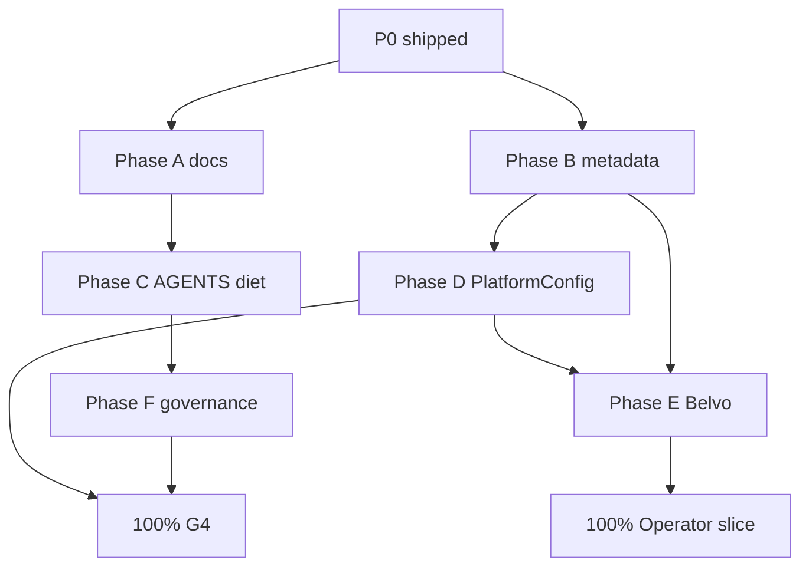

# Full Remediation Plan — G4 Public Sanitization + MADFAM Operator Prod Slice

Last updated: 2026-05-23

Canonical program for reaching **100% public-repo hygiene (G4)** and a **100%
data-rich `admin@madfam.io` operator slice** at `app.dhan.am` / `admin.dhan.am`.

**Related:**

- [Public Repo Security Remediation](PUBLIC_REPO_SECURITY_REMEDIATION.md) (G4 detail)
- [GA Remediation Roadmap](GA_REMEDIATION_ROADMAP.md) Phase 7 + Phase 5 journeys
- [Tech Debt TD-1012](TECH_DEBT.md) (G4) · TD-1013 (operator slice)

## Executive summary

| Track                      | Today (2026-05-23)                  | Target             | Horizon    |
| -------------------------- | ----------------------------------- | ------------------ | ---------- |
| **G4 public sanitization** | ~48% (P0 + A6 + partial P1)         | 100% G4 sign-off   | 6–8 weeks  |
| **Operator prod slice**    | ~65% (ledger + metadata + admin UI) | 100% dogfood-ready | 6–10 weeks |

Both tracks share **Phase 3 (PlatformConfig + admin runtime)** — build once, satisfy
both gates.

```text
Week 1–2   P1 doc relocation + operator metadata backfill
Week 2–4   P2 AGENTS diet + Belvo connect + import re-run (dry→live)
Week 3–5   P3 PlatformConfig + admin UI + remove env-only routing
Week 4–6   P4 dev cred hygiene + personal-space routing fix
Week 6–8   P5 governance + sign-off audits + operator runbook (private)
```

---

## 100% Definition of Done — G4 (public sanitization)

G4 is **100%** when every row below is checked and **TD-1012 is closed**.

### Code & CI

| #     | Criterion                                                                                                | Evidence                           |
| ----- | -------------------------------------------------------------------------------------------------------- | ---------------------------------- |
| G4-C1 | `scripts/check-public-repo-leakage.py` green with **no** doc allowlist for `AGENTS.md` / `llms-full.txt` | CI job + local run                 |
| G4-C2 | No banned literals in tracked source (RFC, passwords, node codenames, insecure HMAC fallback)            | Scanner + manual audit             |
| G4-C3 | Operator scripts require env (`TARGET_USER_EMAIL`, no default `admin@madfam.io` in bash)                 | Code review + scanner              |
| G4-C4 | `gitleaks` or GitHub secret scanning enabled; zero open Critical secret alerts                           | CI / GitHub settings               |
| G4-C5 | PR template: “No operator secrets or MADFAM PII in public diff”                                          | `.github/pull_request_template.md` |

### Documentation

| #     | Criterion                                                                                      | Evidence                             |
| ----- | ---------------------------------------------------------------------------------------------- | ------------------------------------ |
| G4-D1 | Full Vault/topology/runbooks live in **`madfam-org/internal-devops`** only                     | Private repo links in public stubs   |
| G4-D2 | Public `AGENTS.md` ≤ ~200 lines — build, test, modules only                                    | Line count + link to private ops doc |
| G4-D3 | `ECOSYSTEM.md`, `DEPLOYMENT.md`, `COMMERCIAL_STAGING_CREDENTIALS.md` — Enclii-first stubs only | Doc review                           |
| G4-D4 | `infra/k8s/production/external-secret.yaml` — no property inventory comments                   | Diff review                          |
| G4-D5 | Historical audits with live digests moved or redacted                                          | `docs/reports/historical/` banner    |

### Runtime boundary

| #     | Criterion                                                                                | Evidence                             |
| ----- | ---------------------------------------------------------------------------------------- | ------------------------------------ |
| G4-R1 | MADFAM RFC + space routing **not** in git — loaded from `PlatformConfig` or Enclii/Vault | Prod proof                           |
| G4-R2 | Quarterly leakage audit scheduled                                                        | `internal-devops` calendar / TD note |

---

## 100% Definition of Done — Operator prod slice (`admin@madfam.io`)

The operator slice is **100%** when **TD-1013** closes and the operator can run
MADFAM finance **entirely through Janua + app.dhan.am + admin.dhan.am** without
kubectl, git env files, or CSV-only manual paths for routine ops.

### Identity & access

| #     | Criterion                                                           | Evidence                     |
| ----- | ------------------------------------------------------------------- | ---------------------------- |
| OP-I1 | `admin@madfam.io` signs in via Janua on `app.dhan.am`               | Playwright or recorded smoke |
| OP-I2 | Platform admin role on `admin.dhan.am` (queues, audit, billing ops) | Admin JWT smoke              |
| OP-I3 | Operator never needs raw `DATABASE_URL` for routine import/sync     | Runbook                      |

### Spaces & ledger (current prod baseline → target)

| Space               | Today                              | 100% target                                  |
| ------------------- | ---------------------------------- | -------------------------------------------- |
| Innovaciones MADFAM | 16 import txs, 1 account           | + live bank feed, budget w/ metadata         |
| MADFAM Socio AFAC   | 108 import txs, 3 `-afac` accounts | unchanged ids on re-import                   |
| Aldo Personal       | 0 import txs                       | ≥1 account OR explicit personal-routed txs   |
| MADFAM Operations   | seed concept, 0 csv                | Linked ops budget OR documented out-of-scope |

| #     | Criterion                                                                            | Metric / evidence                                            |
| ----- | ------------------------------------------------------------------------------------ | ------------------------------------------------------------ |
| OP-L1 | Import ledger idempotent                                                             | `run-prod-madfam-import-verify.sh` OK before/after re-import |
| OP-L2 | ≥ **124** import txs preserved; re-import adds 0 duplicate `providerTransactionId`   | SQL count + dry-run                                          |
| OP-L3 | All 3 CSV spaces have budgets with `metadata.origin=madfam-csv-import` + `spaceRole` | Prisma / admin view                                          |
| OP-L4 | Partner accounts keep `-afac` suffix                                                 | `madfam-csv-*-afac` unchanged                                |
| OP-L5 | Personal RFC + `Gasto No Deducible` routes to **Aldo Personal** (not partner)        | Import rules + ≥1 tx proof                                   |

### Live data richness

| #     | Criterion                                                              | Metric / evidence                       |
| ----- | ---------------------------------------------------------------------- | --------------------------------------- |
| OP-D1 | ≥ **1 Belvo** (or approved MX provider) connection on operator account | `connect_success` PostHog + account row |
| OP-D2 | Provider sync ≥ hourly; last sync &lt; 24h on connected accounts       | Admin provider dashboard                |
| OP-D3 | Net worth / cashflow views render for ≥2 operator spaces               | Web smoke                               |
| OP-D4 | ≥ **90%** of CSV categories mapped (no orphan categoryId null rate)    | Analytics query                         |
| OP-D5 | PlatformConfig holds business RFC + space names (admin-editable)       | `GET /v1/admin/platform-config`         |

### Operator workflows (admin.dhan.am)

| #     | Criterion                                                                  | Evidence        |
| ----- | -------------------------------------------------------------------------- | --------------- |
| OP-W1 | CSV import trigger documented; preflight mandatory                         | Private runbook |
| OP-W2 | Internal catalog / POS path available for MADFAM billing ops (when scoped) | Admin smoke     |
| OP-W3 | Audit log for platform-config and import actions                           | Admin audit API |

---

## Unified implementation phases

### Phase A — Close P1 doc gaps (Week 1–2) · G4 → ~60%

| ID  | Task                                                                                 | Repo                     | Owner    |
| --- | ------------------------------------------------------------------------------------ | ------------------------ | -------- | -------- |
| A1  | Publish `internal-devops/runbooks/dhanam-catalog-sync-prod.md`; stub public sync doc | dhanam + internal-devops | Ops      |
| A2  | Move staging credential matrix to internal-devops; public doc = pointer only         | dhanam                   | Ops      |
| A3  | Redact `DEPLOYMENT.md` node codenames                                                | dhanam                   | Platform |
| A4  | Trim `external-secret.yaml` property inventory comments                              | dhanam                   | Platform |
| A5  | Redact stability docs with live digests (banner + move)                              | dhanam                   | Platform |
| A6  | Remove `admin@madfam.io` default from `bootstrap-madfam-prod-env.sh` (require env)   | dhanam                   | API      | **Done** |

**Exit:** Manual doc audit — zero Critical findings in public tree.

### Phase B — Operator metadata & routing fix (Week 1–3) · Slice → ~65%

| ID  | Task                                                                         | Repo                              | Owner     |
| --- | ---------------------------------------------------------------------------- | --------------------------------- | --------- | -------------------------- |
| B1  | **Backfill** budget metadata on prod: `origin`, `spaceRole` for 3 CSV spaces | SQL migration script (idempotent) | API + Ops | **Done** (prod 2026-05-23) |
| B2  | Re-run import **dry-run** then selective live for personal-routed rows only  | kubectl job                       | Ops       |
| B3  | Document prod space names in Enclii/Vault (`platform-config/madfam-import`)  | internal-devops                   | Ops       |
| B4  | Weekly `run-prod-madfam-import-verify.sh` in operator checklist              | internal-devops                   | Ops       |

**Exit:** OP-L3, OP-L5 partial; verify script green.

### Phase C — AGENTS.md diet (Week 2–4) · G4 → ~80%

| ID  | Task                                                                                  | Repo            | Owner    |
| --- | ------------------------------------------------------------------------------------- | --------------- | -------- |
| C1  | Create `internal-devops/ecosystem/dhanam-agent-ops.md` (Stripe MX, preview, Karafiel) | internal-devops | Platform |
| C2  | Slim public `AGENTS.md`; redirect in `CLAUDE.md` / `llms.txt`                         | dhanam          | Platform |
| C3  | Remove leakage scanner allowlist for `AGENTS.md`, `llms-full.txt`                     | dhanam          | Platform |
| C4  | Scrub `innovacionesmadfam@`, home paths, historical PHASE3 operator emails            | dhanam          | Platform |

**Exit:** G4-C1, G4-D2, scanner green without allowlist.

### Phase D — PlatformConfig + admin runtime (Week 3–6) · Both → ~90%

| ID  | Task                                                                | Repo   | Owner       |
| --- | ------------------------------------------------------------------- | ------ | ----------- | -------- |
| D1  | Prisma `PlatformConfig` (`key`, `value` JSON, `scope`, `updatedBy`) | dhanam | API         | **Done** |
| D2  | `GET/PATCH /v1/admin/platform-config` + audit events                | dhanam | API + Admin | **Done** |
| D3  | Admin UI: MADFAM Import Settings panel (RFC, space names, suffixes) | dhanam | Admin       | **Done** |
| D4  | Import script reads config from DB when `PLATFORM_CONFIG_SOURCE=db` | dhanam | API         | **Done** |
| D5  | Seed prod rows via admin (not git): `madfam.import.*` keys          | Ops    | Ops         |
| D6  | Ship `internal-catalog.controller` + Vault secret; admin smoke      | dhanam | API         |

**Exit:** G4-R1, OP-D5, OP-W3.

### Phase E — Live provider richness (Week 4–7) · Slice → ~95%

| ID  | Task                                                              | Repo   | Owner     |
| --- | ----------------------------------------------------------------- | ------ | --------- |
| E1  | Belvo sandbox → staging connect smoke                             | dhanam | Web + API |
| E2  | Belvo **prod** connect for `admin@madfam.io` (MX institution)     | Ops    | Ops       |
| E3  | Verify hourly sync + wealth dashboard for operator spaces         | QA     | QA        |
| E4  | Optional: link MADFAM Operations space to manual checking account | Ops    | Ops       |

**Exit:** OP-D1–D3.

### Phase F — Dev creds + governance (Week 5–8) · G4 → 100%

| ID  | Task                                                                                 | Repo                     | Owner    |
| --- | ------------------------------------------------------------------------------------ | ------------------------ | -------- |
| F1  | Replace shared docker-compose passwords with generate-on-setup script                | dhanam                   | Platform |
| F2  | CI ban known demo password literals outside tests                                    | dhanam                   | Platform |
| F3  | `gitleaks` in CI (or enable GH secret scanning)                                      | dhanam                   | Platform |
| F4  | PR template + quarterly audit calendar                                               | dhanam + internal-devops | Platform |
| F5  | P0.8: confirm `.claude/settings.local.json` never committed; rotate tokens if needed | Ops                      | Ops      |
| F6  | Final manual audit → close TD-1012, TD-1013                                          | Security                 | Security |

**Exit:** Full G4 + operator sign-off tables below.

---

## Dependency graph



**Critical path:** B (metadata) → D (PlatformConfig) → E (Belvo) for operator slice;
A → C → F for G4.

---

## Workstream ownership

| Workstream               | Primary         | Repos                                        |
| ------------------------ | --------------- | -------------------------------------------- |
| Public doc sanitization  | Platform        | dhanam, internal-devops                      |
| Leakage CI / governance  | Platform        | dhanam                                       |
| PlatformConfig + import  | API             | dhanam                                       |
| Admin operator UI        | Admin + Web     | dhanam                                       |
| Prod operator ops        | Ops             | Enclii, internal-devops, kubectl break-glass |
| Belvo / provider connect | API + Web + Ops | dhanam                                       |
| Sign-off audit           | Security        | all                                          |

---

## Sign-off meetings

### G4 — 100% public sanitization

| Gate     | Required                 |
| -------- | ------------------------ |
| G4-C1–C5 | All CI/code checks green |
| G4-D1–D5 | Doc audit signed         |
| G4-R1–R2 | Runtime boundary proven  |
| TD-1012  | **Closed**               |

### Operator slice — 100% prod richness

| Gate            | Required                                                             |
| --------------- | -------------------------------------------------------------------- |
| OP-I1–I3        | Identity smoke                                                       |
| OP-L1–L5        | Ledger + routing                                                     |
| OP-D1–D5        | Live data                                                            |
| OP-W1–W3        | Admin workflows                                                      |
| TD-1013         | **Closed**                                                           |
| Private runbook | `internal-devops/runbooks/dhanam-madfam-operator-slice.md` published |

---

## Current prod baseline (2026-05-23)

Recorded during `run-prod-madfam-import-verify.sh`:

- User: `admin@madfam.io` (admin)
- Import txs: **124** · accounts: **4** (`-afac` + business)
- Spaces: Innovaciones MADFAM · MADFAM Socio AFAC · Aldo Personal
- Continuity: **OK** (re-import safe)
- Gaps: no Belvo proof, personal space empty, PlatformConfig migration pending prod deploy, ~~budget metadata null~~ **budget metadata backfilled 2026-05-23**

---

## Implementation order (sprint-sized)

| Sprint | Focus         | Delivers                                              | Status                                                                                               |
| ------ | ------------- | ----------------------------------------------------- | ---------------------------------------------------------------------------------------------------- |
| S1     | A1–A6, B1, B4 | Docs relocated; metadata backfill; bootstrap env-only | **In progress** — A6 ✅, B1 ✅, B4 ✅, D1–D4 ✅, D3 ✅ (admin UI); partial P1 (DEPLOYMENT redaction) |
| S2     | C1–C4, B2–B3  | AGENTS diet; personal routing fix                     |
| S3     | D1–D4         | PlatformConfig API + import reads DB                  | **Done** (code)                                                                                      |
| S4     | D5, D6, E1–E2 | Prod PlatformConfig seed; Belvo prod connect          |
| S5     | E3–E4, F1–F4  | Dashboard proof; governance CI                        |
| S6     | F5–F6         | Audits; close TD-1012 + TD-1013                       |

---

Update progress in this file, [PUBLIC_REPO_SECURITY_REMEDIATION.md](PUBLIC_REPO_SECURITY_REMEDIATION.md),
[GA_REMEDIATION_ROADMAP.md](GA_REMEDIATION_ROADMAP.md), and [TECH_DEBT.md](TECH_DEBT.md) when phases complete.
