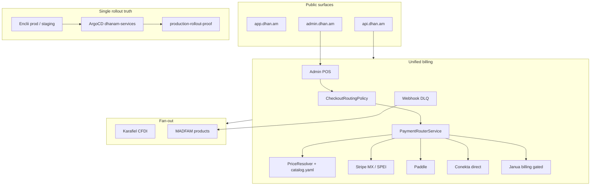

# Dhanam GA Remediation Roadmap

Last updated: 2026-05-22

This document is the **implementation program** for reaching full production
stability and General Availability (GA) for Dhanam as both a consumer product and
the MADFAM billing boundary. It extends [Roadmap](ROADMAP.md) (stability
priorities P0–P8) and [Commercial Stability Roadmap](COMMERCIAL_STABILITY_ROADMAP.md)
(billing/POS detail).

**Language policy:** All implementation work—source code, comments, commit
messages, API contracts, admin copy used in code, runbooks, and technical
documentation—must be written in **English**. End-user i18n (Spanish,
Portuguese, etc.) applies only to product UI strings via the existing i18n
system, not to engineering artifacts.

## Related documents

| Document                                                           | Role                                                     |
| ------------------------------------------------------------------ | -------------------------------------------------------- |
| [Roadmap](ROADMAP.md)                                              | Stability definition, P0–P8 priorities, milestones M1–M5 |
| [Commercial GA Execution](COMMERCIAL_GA_EXECUTION.md)              | WS1–WS6 operator runbook and G2 sign-off checklist       |
| [Commercial Stability Roadmap](COMMERCIAL_STABILITY_ROADMAP.md)    | Billing router and POS launch gate                       |
| [Tech Debt Register](TECH_DEBT.md)                                 | Active debt IDs (TD-1002–TD-1011)                        |
| [Stability Wrap-Up 2026-05-20](STABILITY_WRAP_UP_2026-05-20.md)    | Latest verified production state                         |
| [Launch Operations](LAUNCH_OPERATIONS.md)                          | Consumer GA checklist (legal, stores, providers)         |
| [Credential Onboarding](CREDENTIAL_ONBOARDING.md)                  | Provider activation runbook                              |
| [Billing module README](../apps/api/src/modules/billing/README.md) | Live vs planned billing endpoints                        |

## Purpose and scope

Dhanam serves two roles:

1. **Consumer product** — LATAM-first budget, wealth, and ESG insights (`app.dhan.am`).
2. **Platform service** — Ecosystem billing: catalog checkout, Stripe MX/SPEI,
   usage metering, referrals, signed webhooks to Karafiel, Cotiza, PhyndCRM, and
   other MADFAM products (`api.dhan.am`, `admin.dhan.am`).

This program closes the gap from **~95% production-stable** (May 2026) to
**defensible 100% stability** plus **commercial GA** and **consumer product GA**.

## Mission and vision (execution targets)

**Mission (product):** Unify personal and business budgeting and wealth tracking
with ESG insight so LATAM-first users make cleaner financial decisions.

**Mission (platform):** Operate a reliable LATAM-first money layer: secure
finance data, resilient provider ingestion, transparent billing events, and
stable tooling for all MADFAM products.

**Vision (operations):** A boring production system—every merge tested, staging
smoke-tested, promotion manual and auditable, health explainable, Enclii-first
ops, break-glass exceptional and recorded.

**Vision (commercial):** One authoritative checkout router, a complete internal
MADFAM POS (charge, refund, reconcile, CFDI proof), and versioned product
webhooks with DLQ recovery.

## Baseline (2026-05-22)

| Area                         | Estimate | Evidence                                             |
| ---------------------------- | -------- | ---------------------------------------------------- |
| Overall stability            | 95%      | [Stability Wrap-Up](STABILITY_WRAP_UP_2026-05-20.md) |
| Codebase and CI              | 98%      | Hosted CI, lint, coverage, staging deploy green      |
| Public production            | 99%      | Preflight, full API health, zero failed jobs         |
| Ops control plane            | 88%      | ArgoCD healthy; Enclii rollout truth split           |
| Commercial / POS             | ~75%     | Routing + POS source on main; G2 proof pending       |
| Milestone M1 (queue health)  | Complete | P1 in [Roadmap](ROADMAP.md)                          |
| Milestone M2 (staging smoke) | Complete | API, web, admin smoke green                          |

## GA definition: three gates

GA is not a single checkbox. All three gates must pass before declaring GA.

### G1 — Technical stability GA

Satisfies the [Definition Of 100 Percent Stability](ROADMAP.md#definition-of-100-percent-stability)
plus:

- Single authoritative production rollout control plane (M3).
- Enclii-first routine operations for queues, migrations, policy, staging routes (M5).
- Three documented main → staging → soak → promote → proof → rollback cycles with
  no undocumented manual cluster access.

### G2 — Commercial GA (MADFAM billing)

Satisfies the [Commercial launch gate](COMMERCIAL_STABILITY_ROADMAP.md#5-launch-gate):

- Unified checkout routing policy for all checkout entry points.
- Internal POS: one-time charges, refunds, status timeline, reconciliation,
  Karafiel CFDI/egreso proof.
- Every money event: idempotency key, provider id, correlation id, status, replay path.
- Product webhooks versioned, signed, golden-probed; DLQ replay proven in drill.
- Explicit launch semantics per provider (Stripe MX, Paddle, Conekta, Janua).

**Note:** Commercial GA does **not** require Janua-routed billing if
`JANUA_BILLING_ENABLED=false` remains intentional until E2E proof exists.
Live paths are Stripe MX + Paddle (+ Conekta when Phase 3C proof is recorded).

### G3 — Consumer product GA

Satisfies critical paths in [Launch Operations](LAUNCH_OPERATIONS.md) for the
LATAM-first launch scope (scope may exclude US-only providers at GA):

- Janua SSO end-to-end; Belvo connect and transaction import (Mexico).
- Budget and categorization core loop; self-serve upgrade via live billing path.
- Legal pages published; observability (PostHog, Sentry) verified.
- Mobile store submission **if** mobile GA is in scope for the release (otherwise
  document web-only GA).

## Target end-state architecture

## Program phases

Estimated calendar: **12–16 weeks** with parallel workstreams. Critical path:
**Phase 1 rollout truth → Phase 3 commercial router/POS → golden probes → GA sign-off**.

| Phase | Weeks   | Goal                              | Maps to roadmap   |
| ----- | ------- | --------------------------------- | ----------------- |
| 0     | Ongoing | Protect current production        | P0, P1 (complete) |
| 1     | 1–3     | Authoritative rollout truth       | P3, M3            |
| 2     | 2–6     | Enclii-first operations           | P5, M5            |
| 3     | 3–10    | Commercial billing and POS        | P4, M4, G2        |
| 4     | 6–8     | Provider health semantics         | P6                |
| 5     | 8–14    | Consumer product GA               | G3, P7, P8        |
| Proof | 10–16   | Repeated deploy/rollback evidence | Final 1%          |

---

## Phase 0 — Hold the line (ongoing)

**Goal:** No regression while building forward.

| Task                                                             | Owner       | Acceptance                                                        |
| ---------------------------------------------------------------- | ----------- | ----------------------------------------------------------------- |
| Run `scripts/production-preflight.sh` before/after every promote | Release     | Logged in promote runbook                                         |
| Keep ArgoCD `dhanam-services` Healthy/Synced                     | SRE         | Alert on desync                                                   |
| Queue incidents via admin API first                              | API/on-call | [P1 runbook](ROADMAP.md#p1-make-production-api-full-health-green) |
| Log break-glass with adapter gap in [Tech Debt](TECH_DEBT.md)    | Platform    | TD-1004 updated                                                   |
| Require staging smoke run id for promote                         | CI          | `promote-to-prod.yml`                                             |

---

## Phase 1 — Authoritative rollout truth (M3)

**Closes:** TD-1003, partial TD-1002  
**Target stability:** 97–98%

### Week 1 decision (required)

Choose **one** model and record in [Deployment Guide](DEPLOYMENT.md) and an ADR
if needed:

| Option            | Description                                                                                  |
| ----------------- | -------------------------------------------------------------------------------------------- |
| **A (preferred)** | Enclii `prod` targets live `dhanam` namespace; Enclii deployment records are public truth    |
| **B**             | ArgoCD `dhanam-services` remains canonical; Enclii only feeds digests; document in Enclii UI |

### Implementation tasks

| ID  | Task                                                                                 | Repository                                       | Acceptance                                                  |
| --- | ------------------------------------------------------------------------------------ | ------------------------------------------------ | ----------------------------------------------------------- |
| 1.1 | Fix Enclii prod namespace mapping or formalize Argo-as-truth                         | `internal-devops`, `dhanam`                      | `enclii ps dhanam-api --env production` matches live pods   |
| 1.2 | Run `scripts/production-rollout-proof.js` as required post-promote CI step           | `dhanam` `.github/workflows/promote-to-prod.yml` | Promote fails on digest mismatch (**manifest proof wired**) |
| 1.3 | Staging digest proof: Enclii adapter, self-hosted runner, or documented manual SOP   | `internal-devops`, `dhanam`                      | Every staging deploy has digest evidence within 24h         |
| 1.4 | Eliminate manual Argo hard-refresh after promote                                     | Enclii/Argo                                      | Promote → live digest without operator refresh              |
| 1.5 | Execute three clean cycles: main → staging → soak → promote → proof → rollback drill | Release                                          | Written evidence, no undocumented kubectl                   |

### Phase 1 exit criteria

- [ ] Single documented control plane owns production truth.
- [ ] `production-rollout-proof.js` passes automatically after every production promotion.
- [ ] Rollback drill succeeds using `rollback-prod.yml` only.

---

## Phase 2 — Enclii-first operations

**Closes:** TD-1004  
**Runs parallel to Phase 1** after namespace decision.

### Adapter gaps (Enclii / internal-devops)

| Gap                 | Target capability                                          | Dhanam preparation                               |
| ------------------- | ---------------------------------------------------------- | ------------------------------------------------ |
| Queue remediation   | `enclii ops queues` proxies admin API                      | Endpoints: `GET/POST /v1/admin/queues/*`         |
| DB migration repair | `enclii ops db migrate-repair` with audit                  | Prisma repair playbook from May 2026 break-glass |
| Kyverno waiver      | `enclii ops policy waiver-plan --apply`                    | Idempotency + audit record                       |
| Staging tunnels     | Namespace-aware junction apply for `enclii-dhanam-staging` | Hosts: `staging*.dhan.am`                        |

### Dhanam repo tasks

| ID  | Task                                                                  | Location                                                      |
| --- | --------------------------------------------------------------------- | ------------------------------------------------------------- |
| 2.1 | Contract tests for admin queue API (Enclii adapter consumer)          | `apps/api/src/modules/admin/`                                 |
| 2.2 | Add `docs/runbooks/BREAK_GLASS.md` indexing Enclii-first alternatives | **Done** — [runbooks/BREAK_GLASS.md](runbooks/BREAK_GLASS.md) |
| 2.3 | Require Enclii release id on promote when adapter exists              | `.github/workflows/`                                          |

### Phase 2 exit criteria

- [ ] No routine runbook requires raw `kubectl`, `helm`, SSH, or `docker exec`.
- [ ] May 2026 break-glass scenarios reproducible via Enclii or audited admin API.

---

## Phase 3 — Commercial billing and internal POS (M4, G2)

**Closes:** TD-1009, TD-1010, TD-1011 (Janua path when enabled)  
**Target:** 98% commercial stability  
**Critical path for commercial GA**

### 3A — Unify routing (weeks 3–5)

**Problem:** Two routing layers today:

1. `SubscriptionLifecycleService` — Janua-first, then direct Stripe (wired).
2. `PaymentRouterService` — MX → `stripe_mx`, non-MX → `paddle` (not sole path).

| ID   | Task                                                                    | Detail                                                                                                   |
| ---- | ----------------------------------------------------------------------- | -------------------------------------------------------------------------------------------------------- | ------------------------------------- |
| 3A.1 | Introduce single checkout entry (`CheckoutRoutingPolicy` or equivalent) | All: `POST /billing/upgrade`, `GET /billing/checkout`, admin POS                                         | **Done** (main)                       |
| 3A.2 | Route all checkouts through `PaymentRouterService`                      | Persist: provider, country, currency, product, plan, `price_source`, `route_reason`, `operator_override` | **Done** (audit via hybrid metadata)  |
| 3A.3 | Janua as optional wrapper only                                          | Fail-closed until secrets + E2E proof; do not block G2 on Janua                                          | **Done** (disabled in prod)           |
| 3A.4 | Admin route preview API                                                 | e.g. `POST /v1/admin/billing/route/preview`                                                              | **Done**                              |
| 3A.5 | Matrix tests for country / currency / product combinations              | `apps/api/src/modules/billing/__tests__/`                                                                | **Done** (unit); staging smoke in WS1 |

**Acceptance:** One code path creates checkout sessions; audit explains every routing decision.

### 3B — Complete POS workflows (weeks 5–8)

Extend existing `POST /v1/admin/billing/pos/checkout` and `pos/status`.

| Capability                  | API (proposed)                                      | Admin UI                        | Tests                                 |
| --------------------------- | --------------------------------------------------- | ------------------------------- | ------------------------------------- | ------------------------------------ |
| One-time / line-item charge | `POST /v1/admin/billing/pos/charge`                 | `/pos` cart                     | API + admin E2E                       | **Done** (source); WS1 staging proof |
| Provider-complete timeline  | `GET /v1/admin/billing/pos/timeline/:correlationId` | Timeline panel                  | Stripe MX + Conekta fixtures          | **Done** (source); CFDI enrich WS2   |
| Full refund                 | `POST /v1/admin/billing/pos/refund`                 | Refund action                   | Idempotency                           | **Done** (source)                    |
| Partial refund              | Same + amount                                       | Partial refund UI               | Provider-specific cases               | API **done**; admin UI WS2           |
| Settlement / reconciliation | `GET /v1/admin/billing/reconciliation`              | `/reconciliation`               | Align with nightly reconciliation job | **Done** (source)                    |
| CFDI proof                  | Enrich timeline with Karafiel receipt id            | Display in admin                | Golden probe Dhanam → Karafiel        | WS2                                  |
| Audited provider override   | `POST /v1/admin/billing/route/override`             | Admin-only, high-severity audit | Guard tests                           | WS2                                  |

**Data model:** Every money event must have `idempotency_key`, `provider_id`,
`correlation_id`, `status`, `BillingEvent` row, and DLQ entry on fan-out failure.

### 3C — Conekta commercial parity (weeks 6–9)

Already source-landed: webhooks, ledger writes, `payment.*` fan-out, DLQ.

| Task                          | Acceptance                                |
| ----------------------------- | ----------------------------------------- |
| Refund initiation API         | Sandbox + staging proof recorded          |
| Partial refund handling       | Unit tests + operator runbook             |
| Settlement reconciliation     | Matches Stripe MX reconciliation pattern  |
| Live-mode operator proof      | Documented in commercial proof log        |
| Fail-closed live feature flag | Same pattern as `FEATURE_STRIPE_MXN_LIVE` |

### 3D — Product webhook contracts (weeks 7–10)

| Task                  | Detail                                                                               |
| --------------------- | ------------------------------------------------------------------------------------ |
| Version envelopes     | `payment.*` v2 backward compatible; update billing README                            |
| Golden probes         | Per product: Karafiel, Cotiza, PhyndCRM, Tezca (`madfam-revenue-loop-probe` pattern) |
| DLQ production drill  | Inject failure → list → replay → resolve via `/webhook-dlq`                          |
| `@dhanam/billing-sdk` | POS charge, refund, status, reconciliation for trusted internal callers              |

### Phase 3 exit criteria (G2)

- [ ] Checkout, one-time charge, refund, status timeline, reconciliation implemented and tested.
- [ ] Every money event durable and replayable.
- [ ] Product webhook DLQ proven in staging and production drill.
- [ ] Provider launch semantics documented (Phase 4).
- [ ] Docs, SDK types, and admin UI match source and production behavior.

---

## Phase 4 — Provider health semantics

**Closes:** TD-1005  
**Week 6:** Product/ops policy decision, then encode in code and docs.

### Recommended GA policy (LATAM-first web GA)

| Provider      | GA stance                                | Health `mode`                           |
| ------------- | ---------------------------------------- | --------------------------------------- |
| Belvo (MX)    | Required for consumer GA in Mexico       | `required`                              |
| Stripe MX     | Required for billing GA                  | `required`                              |
| Paddle        | Required when global checkout enabled    | `required`                              |
| Plaid (US)    | Optional at GA; enable when credentialed | `unconfigured` / `optional`             |
| Bitso         | Optional at GA                           | `unconfigured`                          |
| Banxico FX    | Optional; manual FX fallback acceptable  | `unconfigured`                          |
| Conekta       | GA only after Phase 3C proof             | `required` when live flag on            |
| Janua billing | Not live until E2E proof                 | Disabled; `JANUA_BILLING_ENABLED=false` |

### Implementation tasks

| ID  | Task                                                                                           |
| --- | ---------------------------------------------------------------------------------------------- |
| 4.1 | Encode policy in [Credential Onboarding](CREDENTIAL_ONBOARDING.md) and `catalog.yaml` flags    |
| 4.2 | Health endpoint: `up` / `down` / `unconfigured` + `required` / `mode`                          |
| 4.3 | Staging provider smoke (Belvo widget, Stripe checkout, SPEI test mode)                         |
| 4.4 | Failover test: Belvo down → graceful degradation per [Launch Operations](LAUNCH_OPERATIONS.md) |

### Phase 4 exit criteria

- [ ] Optional providers do not imply production instability.
- [ ] Required provider failures fail or degrade health intentionally.

---

## Phase 5 — Consumer product GA (G3)

**Depends on:** G1 stable, G2 self-serve upgrade path, Phase 4 provider policy.

### Core journeys (must pass)

| Journey                          | Proof                                      |
| -------------------------------- | ------------------------------------------ |
| Janua SSO signup / login         | Playwright production or staging smoke     |
| Belvo connect (MX)               | Staging + production per credential policy |
| Import → categorize transactions | E2E `core-value-loop`                      |
| Budget create → alert            | E2E                                        |
| Upgrade Essentials → Pro         | Stripe MX checkout E2E                     |
| SPEI / OXXO (MX)                 | Stripe test then live per flag policy      |
| GDPR export / delete             | Admin + API contract tests                 |

### Engineering workstreams (parallel)

| Stream               | Tasks                                                                                                   | Roadmap                            |
| -------------------- | ------------------------------------------------------------------------------------------------------- | ---------------------------------- |
| Web quality          | Un-skip form validation tests; fix guest-login error UX; remove hardcoded prod URL fallback in non-dev  | P8, historical audit               |
| PMF widget           | Publish `@madfam/pmf-widget`; re-add dep; flip `NEXT_PUBLIC_PMF_WIDGET_ENABLED` after Tulana proof      | AGENTS.md integration note         |
| Pricing validation   | Validate Tulana-anchored tiers with real users before price moves                                       | `internal-devops` pricing decision |
| Mobile (if in scope) | Expand tests (TD-1007); EAS prod builds; store submission per [Launch Operations](LAUNCH_OPERATIONS.md) | P8                                 |
| Docs                 | Historical banner on AWS-era docs; generate API.md from OpenAPI                                         | TD-1008                            |
| Release gates        | Keep P7 gates green on every candidate                                                                  | P7                                 |

### Phase 5 exit criteria (G3)

- [ ] Launch Operations critical-path checklist signed for agreed scope (web vs mobile).
- [ ] Load test: 100 concurrent users, p95 page load &lt; 1.5s (per product NFR).
- [ ] Webhook HMAC verified for all **launched** providers.
- [ ] Backup restore drill documented and executed.

---

## Phase 6 — Operational proof (final 1%)

**Weeks 10–16:** Evidence collection, not feature churn.

| Task                                                                                      | Acceptance                  |
| ----------------------------------------------------------------------------------------- | --------------------------- |
| Three full promote cycles with auto proof                                                 | No manual Argo refresh      |
| 30-day window: zero unexplained failed jobs                                               | Health `failedJobs: 0`      |
| Commercial drill: charge → webhook → DLQ replay → refund → CFDI reference                 | Written operator log        |
| Consumer drill: signup → connect → budget → upgrade                                       | Written QA log              |
| Update [Stability Wrap-Up](STABILITY_WRAP_UP_2026-05-20.md) and [Tech Debt](TECH_DEBT.md) | Close or downgrade TD items |

---

## Phase 7 — Public repository security (G4)

**Closes:** TD-1012  
**Target:** Public-repo GA hygiene alongside G1–G3  
**Canonical plan:** [Public Repo Security Remediation](PUBLIC_REPO_SECURITY_REMEDIATION.md)  
**100% program (G4 + operator slice):** [Full Remediation Plan](FULL_REMEDIATION_PLAN_G4_AND_OPERATOR_SLICE.md)

| Phase | Scope                                                                            | Status      |
| ----- | -------------------------------------------------------------------------------- | ----------- |
| P0    | Stop bleeding: RFC env config, seed/crypto fixes, doc redaction, CI leakage gate | Done        |
| P1    | Relocate full ops runbooks to `internal-devops`                                  | Planned     |
| P2    | Slim public `AGENTS.md`; private agent-ops doc                                   | Planned     |
| P3    | `PlatformConfig` admin API + UI + MADFAM import DB hydration                     | In progress |
| P4    | Dev credential hygiene (`docker-compose`, e2e defaults)                          | Planned     |
| P5    | gitleaks, PR checklist, quarterly audit                                          | In progress |

### G4 exit criteria

- [x] `scripts/check-public-repo-leakage.py` green on `main`
- [ ] No Critical/High manual audit findings open
- [ ] Operator runbooks published in private `internal-devops`
- [x] `PlatformConfig` API shipped; env-only path retained via `PLATFORM_CONFIG_SOURCE=db` opt-in

---

## Workstream ownership

| Workstream                    | Primary owner     | Repos                             |
| ----------------------------- | ----------------- | --------------------------------- |
| Rollout truth / CI gates      | Platform / SRE    | `dhanam`, `internal-devops`       |
| Enclii adapters               | Enclii / platform | `enclii`, `internal-devops`       |
| Billing router + POS          | API + admin       | `dhanam`                          |
| Provider credentials + health | API + ops         | `dhanam`, Enclii secrets          |
| Consumer E2E + web            | Web + QA          | `dhanam`                          |
| Golden revenue probes         | Ecosystem         | `dhanam`, Karafiel, product repos |
| Legal / launch checklist      | Product / ops     | `docs/LAUNCH_OPERATIONS.md`       |

## Risk register

| Risk                                        | Mitigation                                                            |
| ------------------------------------------- | --------------------------------------------------------------------- |
| Enclii adapter delivery slips               | Keep audited admin API + break-glass SOP; do not normalize raw access |
| Janua billing blocks commercial messaging   | Keep disabled; document live Stripe/Paddle paths only                 |
| Dual routing causes wrong provider charges  | Phase 3A is critical path; feature-flag old path during migration     |
| Hosted runners cannot prove staging digests | Self-hosted runner or Enclii proof adapter (Phase 1.3)                |
| Scope creep on consumer GA                  | Sign web-only vs mobile-inclusive GA scope in Phase 5 kickoff         |
| Private npm publish blocks PMF / packages   | Track `NPM_MADFAM_TOKEN` rotation as release dependency               |

## Milestone summary

| Milestone                                 | State (2026-05-22)          | GA gate     |
| ----------------------------------------- | --------------------------- | ----------- |
| M1 — Queue health                         | **Complete**                | G1          |
| M2 — Staging smoke                        | **Complete**                | G1          |
| M3 — Rollout truth                        | In progress                 | G1          |
| M4 — Commercial POS                       | In progress (source landed) | G2          |
| M5 — Enclii adapters + provider semantics | In progress                 | G1 + G2     |
| M6 — Consumer GA                          | Not started                 | G3          |
| M7 — Operational proof                    | Not started                 | G1 final 1% |

## Execution order (canonical)

1. Phase 1 — Rollout truth (M3).
2. Phase 3 — Commercial router and POS (M4, G2) in parallel with Phase 2 where possible.
3. Phase 2 — Enclii adapters (M5).
4. Phase 4 — Provider health semantics.
5. Phase 5 — Consumer GA (G3).
6. Phase 6 — Repeated deploy/rollback and drill evidence.

## GA sign-off checklist

Use this table for the final GA review meeting.

| Gate | Item                                                            | Sign-off                                                                   |
| ---- | --------------------------------------------------------------- | -------------------------------------------------------------------------- |
| G1   | Production preflight + full health green                        |                                                                            |
| G1   | Rollout proof automated post-promote                            |                                                                            |
| G1   | Three clean promote/rollback cycles documented                  |                                                                            |
| G1   | Enclii-first ops for queues, migrations, policy, staging routes |                                                                            |
| G2   | Single checkout routing policy in production                    |                                                                            |
| G2   | POS charge, refund, reconcile, timeline                         |                                                                            |
| G2   | Product webhook DLQ drill passed                                |                                                                            |
| G2   | Golden probes green per launched product                        |                                                                            |
| G2   | Commercial docs match live behavior                             |                                                                            |
| G3   | Core user journeys proven                                       |                                                                            |
| G3   | Legal pages live                                                |                                                                            |
| G3   | Launch Operations scope checklist signed                        |                                                                            |
| G4   | Public repo leakage CI green; no operator secrets in git        | [PUBLIC_REPO_SECURITY_REMEDIATION.md](PUBLIC_REPO_SECURITY_REMEDIATION.md) |
| All  | No open **High** severity tech debt blocking GA                 | [TECH_DEBT.md](TECH_DEBT.md)                                               |

---

When implementation status changes, update this file, [Roadmap](ROADMAP.md), and
[Stability Wrap-Up](STABILITY_WRAP_UP_2026-05-20.md) in the same PR or immediately
after production proof.
