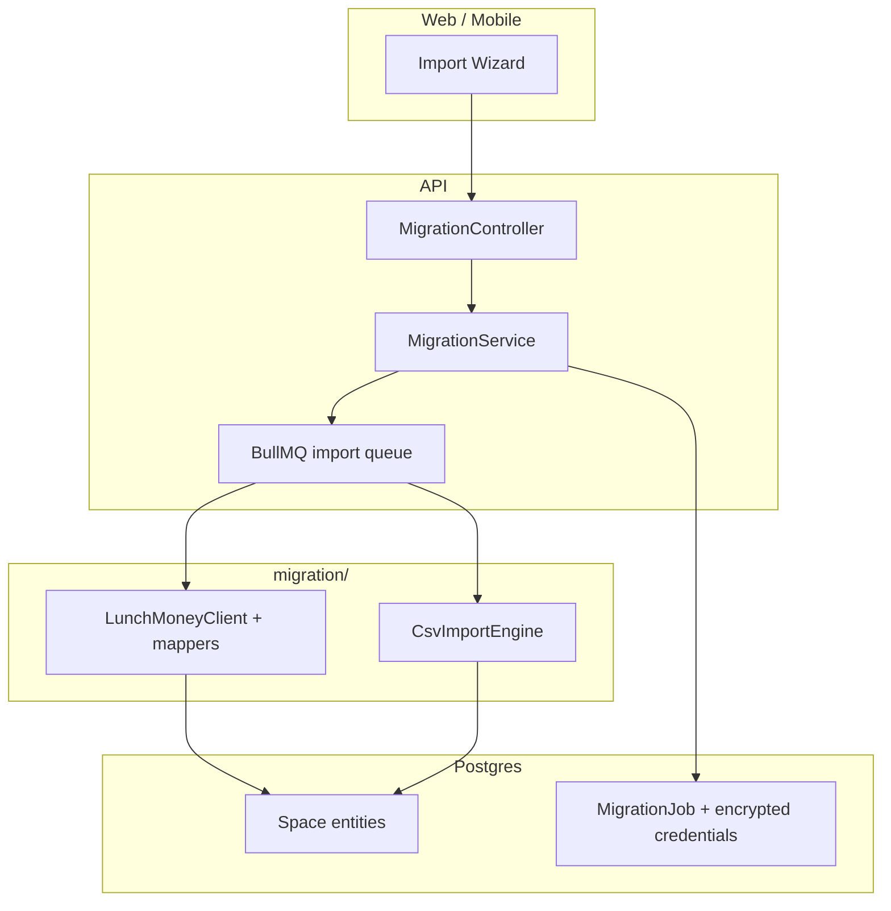

# Platform Migration Roadmap

Last updated: 2026-06-22

**PM-1 status (2026-06-22):** Shipped behind `FEATURE_LUNCHMONEY_IMPORT` (default
`false`). NestJS `MigrationModule`, BullMQ `platform-import` worker, encrypted
token storage, REST API under `/v1/spaces/:spaceId/migration/*`, web wizard at
`/settings/import`. Remaining before M8: staging smoke (PM-1m), entitlements
(PM-1o), PostHog events (PM-1l).

This document is the canonical program for migrating user and customer financial
data from direct and adjacent competitors into Dhanam spaces. It covers backend
import engines, self-serve migration wizards, and go-to-market readiness.

**Not in scope here:** Janua/domain infrastructure migration (see historical
[MIGRATION_CHECKLIST.md](MIGRATION_CHECKLIST.md)), Prisma schema migrations, or
operator-only MADFAM CSV import (documented in
[apps/api/src/modules/migration/README.md](../apps/api/src/modules/migration/README.md)).

Read with:

- [Roadmap](ROADMAP.md) — stability priorities; **P9** tracks this program
- [GA Remediation Roadmap](GA_REMEDIATION_ROADMAP.md) — consumer product GA (G3)
- [Competitive Benchmarks](market-research/competitive-benchmarks.md) — positioning
- [Landing Remediation](LANDING_REMEDIATION.md) — competitor UX; migration is a
  separate product surface from marketing parity
- [Tech Debt Register](TECH_DEBT.md) — **TD-1016**

## Definition Of Done — Customer Migration Product

Dhanam can advertise and support self-serve platform migration when all of the
following are true:

- A user can start import from **Settings → Import** (or onboarding branch) without
  operator CLI access.
- At least **LunchMoney** is supported end-to-end: token capture → preflight
  preview → async job → progress → summary → reconnect-banks guidance.
- Import jobs are **idempotent**, audited, and scoped to the user's space with
  encrypted credential storage and TTL.
- Preflight shows entity counts, date range, skipped rows, and known limitations
  before write.
- Post-import UX guides bank reconnect (Belvo/Plaid) where source accounts were
  snapshot-only.
- i18n covers wizard copy (ES default, EN, pt-BR per product convention).
- Staging smoke includes a sandbox LunchMoney import path.
- Support runbook documents white-glove fallback for incomplete imports.

Generic CSV import and YNAB/Monarch presets are **Phase 3+**; they are not
required for the first customer-facing milestone.

## Current Position

| Platform / path           | Backend engine  | Self-serve wizard   | Est. readiness             | Priority |
| ------------------------- | --------------- | ------------------- | -------------------------- | -------- |
| **LunchMoney**            | Strong          | Wizard (flag-gated) | ~65% engine / ~45% product | P0       |
| **Generic CSV**           | Partial         | None                | ~15%                       | P2       |
| **YNAB**                  | None            | None                | ~0%                        | P3       |
| **Monarch Money**         | None            | None                | ~0%                        | P3       |
| **Rocket Money**          | None            | None                | ~0%                        | P4       |
| **Copilot / others**      | None            | None                | ~0%                        | P5       |
| **MADFAM CSV** (internal) | Operator script | Admin config only   | ~90% operator slice        | Internal |

**Bottom line:** LunchMoney migration is **production-viable for white-glove**
(operator script + API client). It is **not productized** for customers. All other
listed competitors require net-new import work, mostly via generic CSV after LM
is productized.

## What Exists Today

### Migration module (library-only)

Location: `apps/api/src/modules/migration/`

The module is **not** a registered NestJS HTTP module. It provides mappers and
clients consumed by operator scripts and future import jobs.

| Subpackage    | Purpose                                             |
| ------------- | --------------------------------------------------- |
| `lunchmoney/` | LM API client, types, ID map, entity mappers, tests |
| `madfam-csv/` | Internal operator CSV import (not customer-facing)  |

### LunchMoney operator script

`apps/api/scripts/migrate-lunchmoney.ts` — idempotent CLI migration.

**Required env:** `LUNCHMONEY_API_TOKEN`, `TARGET_USER_EMAIL`, `DATABASE_URL`

**Optional env:** `DRY_RUN`, `START_DATE` (default `2024-01-01`), `TARGET_SPACE_ID`,
`LUNCHMONEY_BUDGET_LABEL`

**Entities migrated today:**

| Entity              | Status | Notes                                                         |
| ------------------- | ------ | ------------------------------------------------------------- |
| Categories + groups | ✅     | Duplicate child names → `Group / Child`; income/exclude flags |
| Tags                | ✅     |                                                               |
| Manual assets       | ✅     | `lm-asset-{id}` idempotency                                   |
| Plaid-linked accts  | ⚠️     | Imported as **manual snapshots**; live link not transferred   |
| Crypto positions    | ✅     | Per-currency provider account id                              |
| Transactions        | ✅     | `lm-{id}` idempotency; group parent txs skipped               |
| Tag associations    | ✅     |                                                               |
| Recurring items     | ✅     | Dismissed items skipped                                       |
| Budget amounts      | ⚠️     | Latest month only                                             |
| Auto rules          | ✅     | From ≥3-occurrence merchant patterns per budget               |
| Multi-budget        | ⚠️     | One LM API token → one budget; re-run for other profiles      |

**Not migrated today:**

- Transaction splits (`parent_id`, `has_children` children)
- Real estate / vehicle / loan → Dhanam manual-asset or Zillow flows (map to `other`)
- Full budget envelope history (multi-month)
- LM merchant merge history
- Attachments / receipts
- Goals, Life Beat, household ownership views
- Live bank credentials (users must reconnect via Belvo/Plaid)

### Generic CSV scaffolding (incomplete)

- `PATCH /v1/spaces/:spaceId/documents/:id/csv-mapping` stores column mapping on
  uploaded CSV documents; **does not execute import**.
- Statement ingest (`/compliance/ingest`) is compliance preservation, not transaction
  import.
- MADFAM CSV script is bespoke internal routing — not a customer template.

### Product UX

- Onboarding wizard (`apps/web/src/components/onboarding/onboarding-wizard.tsx`) is
  greenfield only: connect account → budget → goal. No import branch.
- No Settings → Import surface in web or mobile.
- Landing/marketing docs do not promise migration wizards yet.

## Competitor Import Reality

| Source                   | Typical export               | Dhanam strategy                                   |
| ------------------------ | ---------------------------- | ------------------------------------------------- |
| **LunchMoney**           | Developer API (Bearer token) | **Direct API** — engine exists; productize first  |
| **YNAB**                 | CSV (budget + register)      | CSV preset + ZBB mapping; no public migration API |
| **Monarch**              | CSV export                   | CSV preset; household = manual space setup        |
| **Rocket Money**         | Limited budgeting export     | Low overlap; CSV-only, defer unless PMF demand    |
| **Copilot**              | Apple-only; limited export   | Defer                                             |
| **Firefly III / Actual** | OSS formats                  | Community tier opportunity; Phase 5+              |

**Post-import enablers already in product:** zero-based allocation (YNAB-style),
Plaid + Belvo reconnect, ML categorization loop, multi-budget isolation via
`budgetId` filters.

## Execution Phases

### PM-1 — Productize LunchMoney (target: 4–6 weeks)

**Goal:** Self-serve “Import from LunchMoney” for Essentials+ tiers.

**Backend**

| ID    | Task                                                                            | Location / notes                                         |
| ----- | ------------------------------------------------------------------------------- | -------------------------------------------------------- |
| PM-1a | Register `MigrationModule` (NestJS) with JWT-scoped endpoints                   | `apps/api/src/modules/migration/`                        |
| PM-1b | `POST .../migration/lunchmoney/preflight` — read-only LM probe + counts         | Uses `LunchMoneyClient`                                  |
| PM-1c | `POST .../migration/lunchmoney/start` — enqueue BullMQ job                      | Refactor logic from `migrate-lunchmoney.ts`              |
| PM-1d | `GET .../migration/jobs/:id` — progress, summary, errors                        | Standard job pattern                                     |
| PM-1e | Encrypt LM token at rest; TTL + user revoke                                     | Vault/K8s secret pattern or `platform_config` scoped row |
| PM-1f | Audit log: `migration.started`, `migration.completed`, `migration.failed`       | `AuditService`                                           |
| PM-1g | Feature flag: `FEATURE_LUNCHMONEY_IMPORT` (default `false` until staging proof) | ConfigMap                                                |

**Web**

| ID    | Task                                                                       |
| ----- | -------------------------------------------------------------------------- |
| PM-1h | Settings → Import hub with LunchMoney card                                 |
| PM-1i | Wizard: paste API token → link to LM docs → preflight → confirm → progress |
| PM-1j | Post-import step: “Reconnect your banks” with Belvo/Plaid CTAs             |
| PM-1k | i18n keys under `import.lunchmoney.*`                                      |
| PM-1l | PostHog: `migration_started`, `migration_completed`, `migration_failed`    |

**Ops / QA**

| ID    | Task                                                                |
| ----- | ------------------------------------------------------------------- |
| PM-1m | Staging smoke: sandbox LM token → job → entity count assertion      |
| PM-1n | Support runbook: white-glove CLI fallback (`migrate-lunchmoney.ts`) |
| PM-1o | Entitlement gate: Pro+ or operator flag for beta                    |

**PM-1 acceptance**

- Staging user completes LM import without CLI.
- Re-run is idempotent (no duplicate txs/accounts).
- Token never appears in logs, API responses, or exports.
- Preflight shows date range and skipped-row reasons.

### PM-2 — LunchMoney fidelity (target: 2–3 weeks)

**Goal:** Reduce “incomplete switch” support burden.

| ID    | Task                                                                     |
| ----- | ------------------------------------------------------------------------ |
| PM-2a | User-selectable history start (full history default)                     |
| PM-2b | Transaction splits → `TransactionSplit` records                          |
| PM-2c | Map RE/vehicle/loan assets → manual-asset types where schema supports    |
| PM-2d | Multi-budget UI: detect LM profile; offer second import or budget picker |
| PM-2e | Import budget history (multi-month `budgetedAmount` or period snapshots) |
| PM-2f | Validation report downloadable as JSON/CSV                               |

**PM-2 acceptance**

- Split txs from LM appear as Dhanam splits, not dropped parents.
- User importing 5+ years sees configurable range with API batch progress.

### PM-3 — Generic CSV + YNAB/Monarch presets (target: 3–4 weeks)

**Goal:** Cover competitors without dedicated APIs.

| ID    | Task                                                                 |
| ----- | -------------------------------------------------------------------- | ------------------------ |
| PM-3a | CSV import executor wired to stored `csvMapping`                     | Extends documents module |
| PM-3b | Upload → map columns UI (date, amount, payee, category, account)     |
| PM-3c | Presets: `ynab-register`, `ynab-budget`, `monarch-transactions`      | Column templates         |
| PM-3d | Account auto-create or map-to-existing step                          |
| PM-3e | Duplicate detection on `(accountId, date, amount, description hash)` |
| PM-3f | BullMQ job + same progress API as LM                                 |

**PM-3 acceptance**

- YNAB register CSV imports into a new budget with categories mapped or created.
- Monarch CSV imports transactions with ≥95% row match in staging golden file tests.

### PM-4 — Adjacent platforms (as PMF dictates)

| ID    | Task                                 | Trigger                                           |
| ----- | ------------------------------------ | ------------------------------------------------- |
| PM-4a | Rocket Money CSV preset              | Support ticket volume or NPS “coming from” signal |
| PM-4b | Copilot export research              | If iOS export format stabilizes                   |
| PM-4c | Firefly III / Actual Budget adapters | Community tier GTM                                |

## Architecture Target

**Design rules**

- All writes scoped to `spaceId` with `SpacesService.verifyUserAccess`.
- External credentials encrypted; never returned after store.
- Imports are resumable/idempotent via stable external ids (`lm-*`, `csv-*`).
- Fail closed on partial account mapping — surface skips in summary, do not silent-drop without audit.

## Security And Compliance

- Treat LM API tokens like provider secrets (AES-256-GCM at rest, same pattern as Belvo/Plaid tokens).
- Rate-limit preflight/start per user (abuse + LM API courtesy).
- Do not log raw tokens or full LM payloads in production.
- GDPR export must redact migration credentials.
- Admin may view migration job metadata and status, not user tokens.

## GTM And Monetization Alignment

- **First peso path** (B2B Karafiel/Coforma) does not block PM-1; consumer migration
  supports **Essentials/Pro conversion** and competes with Lunch Money's developer-friendly niche.
- Landing remediation ([LANDING_REMEDIATION.md](LANDING_REMEDIATION.md)) can add a
  “Switch from Lunch Money” chapter **after PM-1 staging proof**, not before.
- Recommended tier gate: **Essentials+** for LM API import; **Free** gets CSV import
  (PM-3) with row limits per `usage-limit.guard`.

## Dependencies

| Dependency                                             | Blocks                     |
| ------------------------------------------------------ | -------------------------- |
| G3 consumer GA baseline (auth, spaces, budgets stable) | Marketing import promises  |
| BullMQ import queue + admin job visibility             | PM-1 async UX              |
| Belvo/Plaid connect flows working in staging           | Post-import reconnect step |
| `FEATURE_LUNCHMONEY_IMPORT` staging proof              | Production flag flip       |

## Milestone

| Milestone | Target                          | Roadmap link                                       |
| --------- | ------------------------------- | -------------------------------------------------- |
| **M8**    | LunchMoney self-serve import GA | [ROADMAP.md — M8](ROADMAP.md#stability-milestones) |
| **M8b**   | CSV + YNAB/Monarch presets      | PM-3 complete                                      |
| **M8c**   | Full competitor matrix          | PM-4 as demand-driven                              |

## File Index

| Artifact                   | Path                                                                            |
| -------------------------- | ------------------------------------------------------------------------------- |
| LM client                  | `apps/api/src/modules/migration/lunchmoney/lunchmoney-client.ts`                |
| LM mappers                 | `apps/api/src/modules/migration/lunchmoney/lunchmoney-mapper.ts`                |
| LM mapper tests            | `apps/api/src/modules/migration/lunchmoney/__tests__/lunchmoney-mapper.spec.ts` |
| Operator script            | `apps/api/scripts/migrate-lunchmoney.ts`                                        |
| CSV mapping API            | `apps/api/src/modules/documents/documents.controller.ts`                        |
| Onboarding (no import yet) | `apps/web/src/components/onboarding/onboarding-wizard.tsx`                      |
| Module README              | `apps/api/src/modules/migration/README.md`                                      |

## White-Glove Runbook (Until PM-1 Ships)

For design partners and early customers migrating from LunchMoney today:

1. User creates Dhanam account and space via normal signup.
2. User generates LM API token (Settings → Developers in Lunch Money).
3. Operator runs preflight: `DRY_RUN=true LUNCHMONEY_API_TOKEN=... TARGET_USER_EMAIL=... pnpm --filter @dhanam/api tsx scripts/migrate-lunchmoney.ts`
4. Review logs for skipped transactions and account mapping gaps.
5. Run live import; share summary counts with user.
6. Guide user to reconnect banks in Dhanam (Belvo MX / Plaid US) — balances will sync forward; historical txs remain from import.
7. Optional: set `START_DATE` for full history; re-run is safe (idempotent).

Never commit tokens, operator emails, or customer payloads to git.
